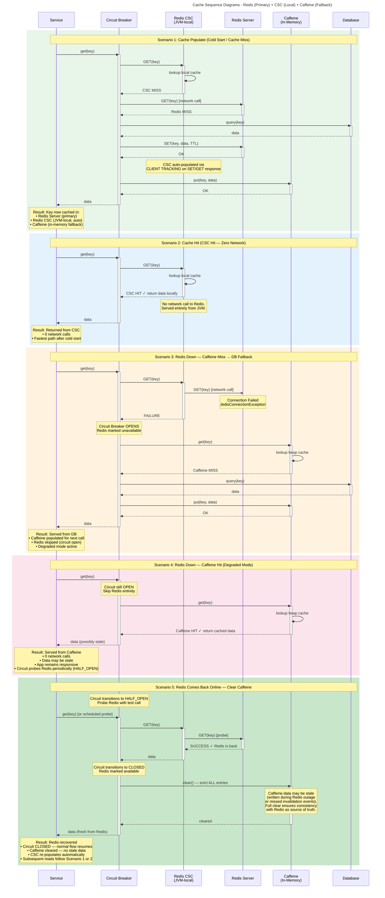

```mermaid
sequenceDiagram
    title Cache Sequence Diagrams - Redis (Primary) + CSC (Local) + Caffeine (Fallback)

    participant Svc as Service
    participant CB as Circuit Breaker
    participant CSC as Redis CSC<br/>(JVM-local)
    participant Redis as Redis Server
    participant Caff as Caffeine<br/>(In-Memory)
    participant DB as Database

    rect rgb(232, 245, 233)
    Note over Svc, DB: Scenario 1: Cache Populate (Cold Start / Cache Miss)

    Svc ->> CB: get(key)
    activate CB
    CB ->> CSC: GET(key)
    activate CSC
    CSC ->> CSC: lookup local cache
    CSC -->> CB: CSC MISS
    deactivate CSC

    CB ->> Redis: GET(key) [network call]
    activate Redis
    Redis -->> CB: Redis MISS
    deactivate Redis

    CB ->> DB: query(key)
    activate DB
    DB -->> CB: data
    deactivate DB

    CB ->> Redis: SET(key, data, TTL)
    activate Redis
    Redis -->> CB: OK
    deactivate Redis

    Note over CSC: CSC auto-populated via<br/>CLIENT TRACKING on SET/GET response

    CB ->> Caff: put(key, data)
    activate Caff
    Caff -->> CB: OK
    deactivate Caff

    CB -->> Svc: data
    deactivate CB

    Note over Svc: Result: Key now cached in:<br/>• Redis Server (primary)<br/>• Redis CSC (JVM-local, auto)<br/>• Caffeine (in-memory fallback)
    end

    rect rgb(227, 242, 253)
    Note over Svc, DB: Scenario 2: Cache Hit (CSC Hit — Zero Network)

    Svc ->> CB: get(key)
    activate CB
    CB ->> CSC: GET(key)
    activate CSC
    CSC ->> CSC: lookup local cache
    CSC -->> CB: CSC HIT ✓ return data locally
    deactivate CSC

    Note over CSC: No network call to Redis.<br/>Served entirely from JVM.

    CB -->> Svc: data
    deactivate CB

    Note over Svc: Result: Returned from CSC<br/>• 0 network calls<br/>• Fastest path after cold start
    end

    rect rgb(255, 243, 224)
    Note over Svc, DB: Scenario 3: Redis Down — Caffeine Miss → DB Fallback

    Svc ->> CB: get(key)
    activate CB

    CB ->> CSC: GET(key)
    activate CSC
    CSC -x Redis: GET(key) [network call]
    Note over Redis: Connection Failed<br/>JedisConnectionException
    CSC -->> CB: FAILURE
    deactivate CSC

    Note over CB: Circuit Breaker OPENS<br/>Redis marked unavailable

    CB ->> Caff: get(key)
    activate Caff
    Caff ->> Caff: lookup heap cache
    Caff -->> CB: Caffeine MISS
    deactivate Caff

    CB ->> DB: query(key)
    activate DB
    DB -->> CB: data
    deactivate DB

    CB ->> Caff: put(key, data)
    activate Caff
    Caff -->> CB: OK
    deactivate Caff

    CB -->> Svc: data
    deactivate CB

    Note over Svc: Result: Served from DB<br/>• Caffeine populated for next call<br/>• Redis skipped (circuit open)<br/>• Degraded mode active
    end

    rect rgb(252, 228, 236)
    Note over Svc, DB: Scenario 4: Redis Down — Caffeine Hit (Degraded Mode)

    Svc ->> CB: get(key)
    activate CB

    Note over CB: Circuit still OPEN<br/>Skip Redis entirely

    CB ->> Caff: get(key)
    activate Caff
    Caff ->> Caff: lookup heap cache
    Caff -->> CB: Caffeine HIT ✓ return cached data
    deactivate Caff

    CB -->> Svc: data (possibly stale)
    deactivate CB

    Note over Svc: Result: Served from Caffeine<br/>• 0 network calls<br/>• Data may be stale<br/>• App remains responsive<br/>• Circuit probes Redis periodically (HALF_OPEN)
    end

    rect rgb(200, 230, 201)
    Note over Svc, DB: Scenario 5: Redis Comes Back Online — Clear Caffeine

    Note over CB: Circuit transitions to HALF_OPEN<br/>Probe Redis with test call

    Svc ->> CB: get(key) [or scheduled probe]
    activate CB

    CB ->> CSC: GET(key)
    activate CSC
    CSC ->> Redis: GET(key) [probe]
    activate Redis
    Redis -->> CSC: SUCCESS ✓ Redis is back
    deactivate Redis
    CSC -->> CB: data
    deactivate CSC

    Note over CB: Circuit transitions to CLOSED<br/>Redis marked available

    CB ->> Caff: clear() — evict ALL entries
    activate Caff
    Note over Caff: Caffeine data may be stale<br/>(written during Redis outage<br/>or missed invalidation events).<br/>Full clear ensures consistency<br/>with Redis as source of truth.
    Caff -->> CB: cleared
    deactivate Caff

    CB -->> Svc: data (fresh from Redis)
    deactivate CB

    Note over Svc: Result: Redis recovered<br/>• Circuit CLOSED — normal flow resumes<br/>• Caffeine cleared — no stale data<br/>• CSC re-populates automatically<br/>• Subsequent reads follow Scenario 1 or 2
    end
```
